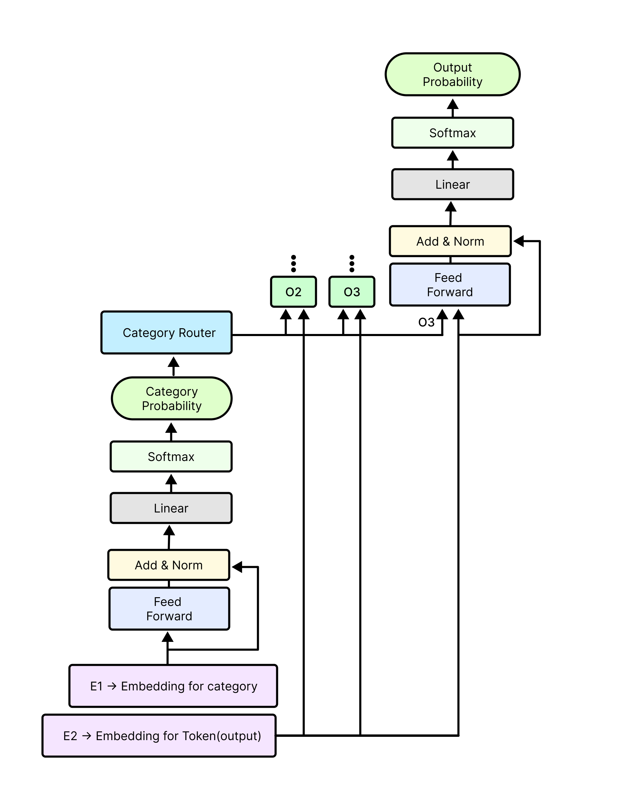

# Curious Learner Model

In this repository we have implemented our curious learner model, Initially we have
created a vanilla transformer model using our own vocabulary, In the vocabulary we have
considered every unique category map and token combination as a token, while using the 
sentence encoder for tokenizer. That model worked perfectly.  

Then we implemented our decoder only generative curious learner model, whose architecture
is given below. We have trained this model on four generative task, those are,

1. [Function to Function Translation Dataset](cl_data/func_func) 
2. [Function to Natural Language Translation Dataset](cl_data/func_nl)
3. [Natural Language to Function Translation Dataset](cl_data/nl_func)
4. [Natural Language & Function to Natural Language & Function Translation Dataset](cl_data/nlf_nlf)

## Table of Contents

- [Project Overview](#project-overview)
- [Folder Structure](#folder-structure)
- [Architecture](#architecture)
- [Function Representation](#function-representation)
- [CL Data](#CL-Data)
- [Vocabulary Builder](#vocabulary-Builder)
- [Embedding Manager](#Embedding-Manager)
- [Category Router](#Category-Router)
- [Data Loader](#Data-Loader)
- [Response Parser](#Response-Parser)
- [Evaluation Metric](#Evaluation-Metric)
- [CL Pre-Trainer](#CL-Pre-Trainer)
- [How to Run](#how-to-run)
- [License](#license)

## Project Overview

As curious learner is a neuro-symbolic approach to LLM, it provides some greate benefits, such as
1. Partial Interpretability
2. Consistent result for very hard problems by using symbolic functions
3. Scoped NLP based tools, ex: Command line tools
4. Customer service automation with ability to perform automated task
5. Service discovery automation
6. Project code automation
7. Natural Language-based Operating System

We encountered several challenges during the development of this architecture, with two of the most significant being:

1. We are using category router, for routing token to their specific classification head, but this can be done in
two ways, We tried both method but due to time constraint can't make Switch method work, So we're using the hub method 
while using notMyToken for all the tokens which aren't meant to be classified by the other classification heads.
   1. Switch method(Optimized) -> Route each token to only their specific classification head
   2. Hub method(Non-Optimized) -> Route each token to each classification head

2. We initially considered employing a Siamese network to establish relationships between functions. 
However, this approach quickly became unwieldy as the model's size expanded, prompting us to abandon the idea.

## Folder Structure

- `assets` 
- `category_router` 
- `cl_data` 
- `cl_pretrainer` 
- `data_loader` 
- `documentation` 
- `embeddings_manager` 
- `evaluation_metric` 
- `response_parser` 
- `vocabulary_builder` 

## Function Representation
Function Representation repository contain 92 functions, 
on whom we have trained our curious learner model.

See [cl_data/function_representation](cl_data/function_representation/README.md) for more detail.

## CL Data
In this package we have created training and testing data for curious learner generative model. As curious learner 
is a generative next word prediction model, so  each question or prompt may have multiple answers equally correct.
That's why we created the data in such a way that we can generate random answer between the equally correct answers 
each time. And we can generate as many example as we want.  

See [cl_data](cl_data/README.md) for more detail.

## Vocabulary Builder

## Embedding Manager

## Category Router

## Data Loader

## Response Parser

## Evaluation Metric

## CL Pre-Trainer

## Response Parser

## How to Run

## License
This repository is licensed under the GNU Affero General Public License - see the [LICENSE.md](LICENSE) file for details.

## cl_model
All models required for curious learner.

### Curious Learner Pre-trainer
This model will be trained for two specific task, 
1. Masked Token Prediction.
2. Next Token Prediction.

Goals/Scope for Curious Learner Pre-trainer.
1. Get significant accuracy in the chosen tasks.
2. Make the attention blocks/layers transferable.

#### Architecture

#### Category Router detailed part

