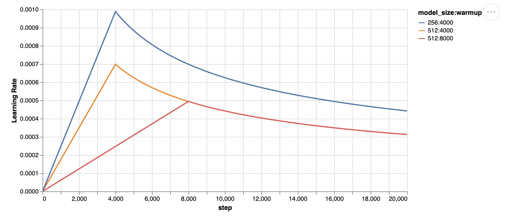

# Curious Learner Model

In this repository we have implemented our curious learner model, Initially we have
created a vanilla transformer model using our own vocabulary, In the vocabulary we have
considered every unique category map and token combination as a token, while using the 
sentence encoder for tokenizer. That model worked perfectly.  

Then we implemented our decoder only generative curious learner model, whose architecture
is given below. We have trained this model on four generative task, those are,

1. [Function to Function Translation Dataset](cl_data/func_func) 
2. [Function to Natural Language Translation Dataset](cl_data/func_nl)
3. [Natural Language to Function Translation Dataset](cl_data/nl_func)
4. [Natural Language & Function to Natural Language & Function Translation Dataset](cl_data/nlf_nlf)

## Table of Contents

- [Project Overview](#project-overview)
- [Folder Structure](#folder-structure)
- [Architecture](#architecture)
- [Function Representation](#function-representation)
- [CL Data](#CL-Data)
- [Vocabulary Builder](#vocabulary-Builder)
- [Embedding Manager](#Embedding-Manager)
- [Category Router](#Category-Router)
- [Data Loader](#Data-Loader)
- [Response Parser](#Response-Parser)
- [Evaluation Metric](#Evaluation-Metric)
- [CL Pre-Trainer](#CL-Pre-Trainer)
- [How to Run](#how-to-run)
- [License](#license)

## Project Overview
On it's core Curious Learner is a natural language function executor, which can find appropriate function 
and their parameters based on natural language prompts.  
As curious learner is a neuro-symbolic approach to LLM, it provides some greate benefits, such as
1. Partial Interpretability
2. Consistent result for very hard problems by using symbolic functions
3. Scoped NLP based tools, ex: Command line tools
4. Customer service automation with ability to perform automated task
5. Service discovery automation
6. Project code automation
7. Natural Language-based Operating System

We encountered several challenges during the development of this architecture, with two of the most significant being:

1. We are using category router, for routing token to their specific classification head, but this can be done in
two ways, We tried both method but due to time constraint can't make Switch method work, So we're using the hub method 
while using notMyToken for all the tokens which aren't meant to be classified by the other classification heads.
   1. Switch method(Optimized) -> Route each token to only their specific classification head
   2. Hub method(Non-Optimized) -> Route each token to each classification head

2. We initially considered employing a Siamese network to establish relationships between functions. 
However, this approach quickly became unwieldy as the model's size expanded, prompting us to abandon the idea.

## Folder Structure

- `assets` this folder contains all assets and diagram related to CL per-trainer model.
- `category_router`
  - `category_router.py`
- `cl_data` Please read the [CL Data](#CL-Data) section.
- `cl_pretrainer` 
  - `assess.ipynb`
  - `batch_builder.py`
  - `category_map_block.py`
  - `category_map_classification_head.py`
  - `category_map_decoder.py`
  - `checkpoint_manager.py`
  - `cl_pre_trainer.py`
  - `common_block.py`
  - `decoder.py`
  - `encoder.py`
  - `inference.py`
  - `lr_scheduler.py`
  - `multi_head_attention.py`
  - `output_token_block.py`
  - `output_token_classification_head.py`
  - `output_token_decoder.py`
  - `pre_trainer_checkpoint_manager.py`
  - `pre_trainer_inference_hub.py`
  - `pre_trainer_inference_switch.py`
  - `pre_trainer_train_hub.py`
  - `pre_trainer_train_switch.py`
  - `pre_trainer_utils.py`
  - `rmsnorm_torch.py`
  - `swiglu_activation.py`
  - `train.py`
  - `transformer.py`
- `data_loader` 
  - `data_generator.py`
  - `data_loader.py`
- `documentation` This folder contain some basic documentation, which is used while developing the model as reference.
- `embeddings_manager` 
  - `alibibi_positional_encoder.py`
  - `category_and_task_encoder.py`
  - `embeddings_manager.py`
  - `initial_function_encoder.py`
  - `initial_word_encoder.py`
  - `positional_encoder.py`
  - `rotary_positional_encoder.py`
- `evaluation_metric` 
  - `bleu.py`
  - `perplexity.py`
- `response_parser`
  - `response_parser.py`
  - `simple_response_parser.py`
- `vocabulary_builder` 
  - `category_vocabulary_builder.py`
  - `output_vocabulary_builder.py`
  - `simple_vocabulary_builder.py`

## Architecture

### Category Router detailed part

Each part of the architecture is explained in detail...

## Function Representation
Function Representation repository contain 92 functions, 
on whom we have trained our curious learner model.

See [cl_data/function_representation](cl_data/function_representation/README.md) for more detail.

## CL Data
In this package we have created training and testing data for curious learner generative model. As curious learner 
is a generative next word prediction model, so  each question or prompt may have multiple answers equally correct.
That's why we created the data in such a way that we can generate random answer between the equally correct answers 
each time. And we can generate as many example as we want.  

See [cl_data](cl_data/README.md) for more detail.

## Vocabulary Builder

Vocabulary builder is used for keeping track of all the vocabs. We have two models
1. Vanilla transformer   
In this model we used the [simple_vocabulary_builder.py](vocabulary_builder/simple_vocabulary_builder.py) module
Generally in the vocabulary builder we create a hashable vocabItem which is then kept track of.
There are three type of item, such as
   1. Index
   2. Vocab Item
   3. IO Parser Output  
So in the vocabulary builder we have two types of encoding and decoding functions, and their equivalent of batch encoding and decoding functions,
   * encode = io parser output -> vocab items -> integer token
   * decode = integer token -> vocab items -> io parser output
   * encode_io_parser_item_into_vocab_item = io parser output -> vocab items
   * decoder_vocab_item_into_io_parser_output = vocab items -> io parser output

2. Curious Learner Pre-Trainer  
In this model we used both,
   1. [category_vocabulary_builder.py](vocabulary_builder/category_vocabulary_builder.py)  
   In category_vocabulary_builder there are four types of items with their encode and decode functions. These four types of items are,
      - Index
      - CategoryVocabItem : Is the hashable category map for a token.
      - OutputTokenClassificationHeadVocabItem : Is the hashable output token classification head type for the token
      - IO Parser Output
   2. [output_vocabulary_builder.py](vocabulary_builder/output_vocabulary_builder.py)
   In output_vocabulary_builder there are three types of items with their encode and decode functions. These three types of items are,
      - Index
      - OutputVocabItem
      - IO Parser Output  

## Embedding Manager
Embedding manager is converting the tokens into embeddings, adding proper category and task information with it.
We are using [alibibi_positional_encoder.py](embeddings_manager/alibibi_positional_encoder.py) for adding the positional
information into the tokens. 

In [initial_word_encoder.py](embeddings_manager/initial_word_encoder.py) we are using the `"all-mpnet-base-v2"` model for 
converting the tokens into embeddings.  

While in [initial_function_encoder.py](embeddings_manager/initial_function_encoder.py) we are using the `"microsoft/graphcodebert-base"` 
model for converting functions tokens into embeddings.  

In the [category_and_task_encoder.py](embeddings_manager/category_and_task_encoder.py) we are add the category and task information along
with the make tokens embeddings.  

While [embeddings_manager.py](embeddings_manager/embeddings_manager.py) is the main module which is passed in the CL-Pre-trainer model
for being used as the tokenizer which converts the tokens into their respective embeddings.

## Category Router

In the category router we have output token classification head for each unique `OutputTokenClassificationHeadVocabItem` that is 
present in the training data. This module is responsible for creating these output token classification heads and routing each token
based on it's routing index, which can be created using the category map probability of that token.

Here we also have two method for guiding the tokens to their specific routes. Those are:
1. Hub Method: In this method we pass every token to every output token classification head, But if the token is not of that classification
head then we identify that as 'notMyToken'. This approach helps the training convergence time, as we can utilize the attention layer 
properly here, though this is a really unoptimized solution because we are performing multiple redundant calculation.
2. Switch Method: In the switch method, we pass each token to its specific output token classification head, So this is a very optimized 
approach, but as attention layer need all sequential words for working properly, as if we pass token to classification head based on its 
route then this sequence is broken so, backpropagation takes lots of time while sometimes it doesn't even work. That's why we have used 
this approach only in the inference.

## Data Loader

Data loader package is responsible for loading the datas for training and testing of the CL-Pre-Trainer model
it consist of two file, [data_generator.py](data_loader/data_generator.py) will create batches of example upon 
request then [data_loader.py](data_loader/data_loader.py) will add necessary information along with it so that
we can use the example in the training.  

Data loader package support both random data loading and also loading data using identifier.  

For data, we are using the previously mentioned four tasks, where each task contains our 98 functions and each functions
contain multiple examples.

## Response Parser

Response Parser parse the category probability and output probability and create the response of curious learner which is
human understandable result.  

[simple_response_parser.py](response_parser/simple_response_parser.py) is just a demo module which combines the category 
probability and token probability and prints that in the console.  

While [response_parser.py](response_parser/response_parser.py) actually uses the predicted category probability and output
token probability combines them, execute the functions using the params and return the result in a plain text form.  

## Evaluation Metric

Evaluation Metrics package contains the evaluation metrics that's been used to calculate the performance of curious learner 
pre trainer. We are using two evaluation metrics, these are:
1. BLEU Score:
The BLEU (Bilingual Evaluation Understudy) score is a metric commonly used for evaluating the quality of
machine-generated text, such as in the context of text generation tasks in NLP. BLEU compares the generated text to 
reference human-generated text and assigns a score based on the similarity of n-grams (subsequences of n words). 
The BLEU score ranges from 0 to 1, with 1 indicating perfect similarity. For the implementation please check out 
[bleu.py](evaluation_metric/bleu.py) module.
2. Perplexity: 
Perplexity is a measurement used to evaluate how well a probability distribution or a probability model predicts a sample. 
In the context of natural language processing and language modeling, perplexity is often used to assess the performance of 
a language model in predicting a sequence of words. For the implementation please check out 
[perplexity.py](evaluation_metric/perplexity.py) module.

## CL Pre-Trainer
We have two model in this package,
1. Vanilla Transformer model: Please go through [architecture_doc.md](documentation/architecture_doc.md) for further explanation.
   - `lr_scheduler.py`:
     - Adam optimizer use constant learning rate. lr_scheduler ensure an upward trajectory for some step. After that it decrease the learning rate at a constant slope.
     

   - `multi_head_attention.py`: implementation of multi head attention with ALiBiBi positional encoding.
   - `encoder.py`: Implementation of vanilla transformer encoder.
   - `decoder.py`: Implementation of vanilla transformer decoder.
   - `transformer.py`: Implementation of the vanilla transformer with the encoder and decoder.
   - `train.py`: Training code for the vanilla transformer.
   - `inference.py`: Inference code for the vanilla transformer.
   - `checkpoint_manager.py`: Saving code for the vanilla transformer.

2. Curious Learner Pre Trainer model
   - `assess.ipynb`: This is a testing notebook, for testing some snippet of code before using.
   - `batch_builder.py`: Implementation of the batch builder for the model.
   - `lr_scheduler.py`: - Adam optimizer use constant learning rate. lr_scheduler ensure an upward trajectory for some step. After that it decrease the learning rate at a constant slope.
     

   - `multi_head_attention.py`: implementation of multi head attention with ALiBiBi positional encoding.
   - `rmsnorm_torch.py`: Implementation of root-mean-square normalization.
   - `swiglu_activation.py`: Implementation of swiglu activation function. This isn't used in the model.
   - `common_block.py`: This is the first attention block, which is common for both the category map and output token.
   - `category_map_block.py`: This is the category map attention block, with a feed forward network.
   - `category_map_decoder.py`: This is the Nx serial block of calculating the Embeddings for category.
   - `category_map_classification_head.py`: Classification head for figuring out the category map token index.
   - `output_token_block.py`: This is the output token attention block, with a feed forward network.
   - `output_token_decoder.py`:This is the Nx serial block of calculating the Embeddings for output token.
   - `output_token_classification_head.py`: Classification head for figuring out the output token index.
   - `cl_pre_trainer.py`: The main file which assembly all part of curious learner.
   - `pre_trainer_utils.py`: Utilities that's been used throughout the cl pre trainer model.
   - `pre_trainer_checkpoint_manager.py`: Module for saving the CL Pre Trainer model.
   - `pre_trainer_train_hub.py`: Training module for CL Pre Trainer model using hub method.
   - `pre_trainer_train_switch.py`: Training module for CL Pre Trainer model using switch method.
   - `pre_trainer_inference_hub.py`: Inference module for CL Pre Trainer model using hub method.
   - `pre_trainer_inference_switch.py`: Inference module for CL Pre Trainer model using switch method.

## How to Run
Below you can find how to run the vanilla transformer model and curious learner pre trainer model.

#### Vanilla Transformer model using IO Parser output as token.
To run this model navigate to [train.py](cl_pretrainer/train.py) module, in that file you will find 
`TestTransformerTraining` class which have two test functions,
1. `test_train_and_save` function will train the model on some sample provided in that function and save the model in the  
following location `"./saved_models/model.pth"`
2. While `test_model_load` function will load the trained model from the specified `"./saved_models/model.pth"` location
and inference on that, and print the output using [simaple_response_parser.py](response_parser/simple_response_parser.py) 
to the console.

#### Curious Learner Pre Trainer model
To train this model navigate to [pre_trainer_train_hub.py](cl_pretrainer/pre_trainer_train_hub.py) module, in that file you will find 
`TestClPreTrainerTraining` class which have two test functions,
1. `test_cl_pre_trainer_train_and_save` function will train the model on some sample provided in that function, and save the last model
in the following location `"./saved_models/cl_pre_trainer_generative_last.pth"` and the best model in the following location 
`"./saved_models/cl_pre_trainer_generative_best.pth"`
2. While `test_cl_pre_trainer_model_load` function will load the best model from the saved location and inference on the given 
samples and print the result in the console.

For inference on this model we have two options, 
1. [pre_trainer_inference_hub.py](cl_pretrainer/pre_trainer_inference_hub.py) where we used the hub method for inference.
2. [pre_trainer_inference_switch.py](cl_pretrainer/pre_trainer_inference_switch.py) where we used switch method for inference.

In both of these inference methods we use BLEU and Perplexity as model performance evaluation metrics and response parser for 
parsing the result in a human understandable form.

## License
This repository is licensed under the GNU Affero General Public License - see the [LICENSE.md](LICENSE) file for details.

