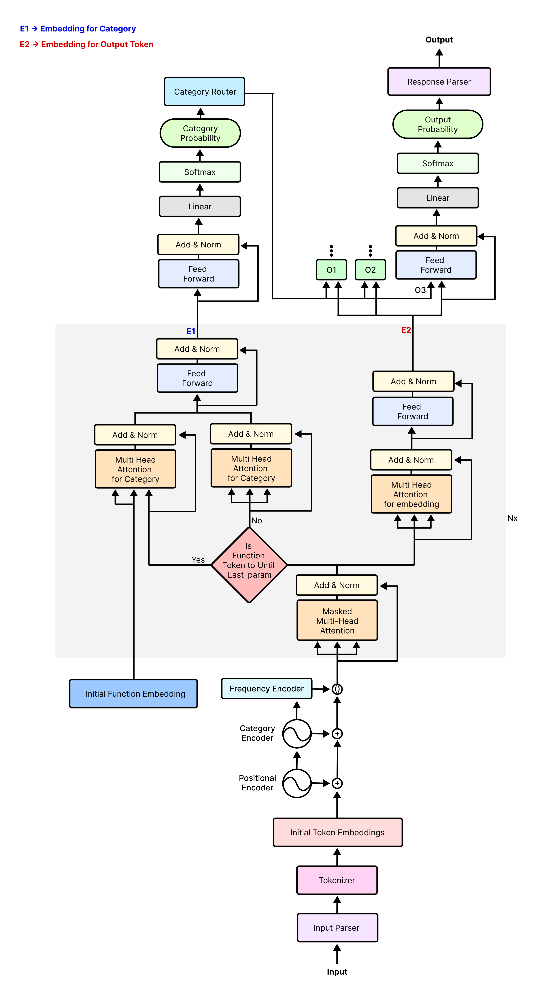

## cl_model
All models required for curious learner.

### Curious Learner Pre-trainer
This model will be trained for two specific task, 
1. Masked Token Prediction.
2. Next Token Prediction.

Goals/Scope for Curious Learner Pre-trainer.
1. Get significant accuracy in the chosen tasks.
2. Make the attention blocks/layers transferable.

#### Architecture

#### Router detailed part

