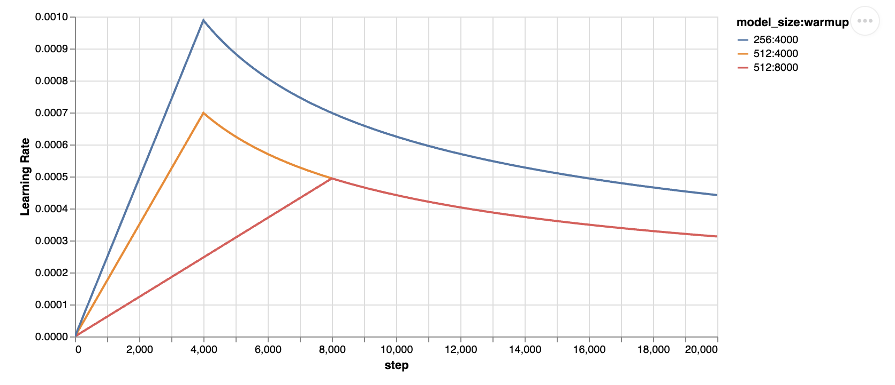

### Sequence

1. vocabulary
    - This is the tokenizer, convert the words into tokens, 
    tokens are integer numbers, 
    Adding Special tokens is also tokenizers functions.

2. nn.embeddings layer
    - Creating random embeddings provided a token.

3. utils
    - Construct batches from src and trt string
    - Tokenize the src and trt string in batches
    - Add musk for encoder/src and decoder/trt (Future musking)

4. positional_encodings
   - Given hidden dimension create position embeddings.
   - Token have to be given in [batch_size, sequence_len, hidden_dim]

5. lr_scheduler
   - Adam optimizer use constant learning rate.
   - lr_scheduler ensure an upward trajectory for some step.
   - After that it decrease the learning rate at a constant slope.
   

6. multi_head_attention
   - As attention layers are parallel, we will compute attention
   for each head in parallel.
   - qkv_proj for all head is [hidden_dim, 3 * num_head * qkv_dim]
   - o_proj need to be [qkv_dim * num_head, hidden_dim] 
   as we need the hidden dimension embeddings back.
   - _reset_parameters is making random weight uniformly distributed.
   - Three type of attention mechanism Encoder Self Attention,
   Decoder Self Attention, Encoder-Decoder Attention.
   - Two type of musking is used, src_padding_musk and target_future_musk.
   - src_padding_musk is used to musk all padding token of the src tokens.
   - target_future_musk is used to musk all future tokens of trt tokens.

   - scaled_dot_product figure out the attention_score and scaled values.
   - forward Reshape value to remove head_num and project on wo to find last value.

7. EncoderBlock
   - dropout + multi_head_attention to layer_normalization
   - dropout + feed_forward to layer_normalization
   - This is one encoder_block

8. TransformerEncoder
   - From tokens create the embeddings.
   - Add positional embeddings.
   - Add some dropouts.
   - pass through all the encoder_blocks and return the output as (N, S, E)

9. DecoderBlock
   - dropout + multi_head_attention to layer_normalization
   - dropout + cross_multi_head_attention to layer normalization
   - dropout + feed_forward to layer_normalization
   - This is one decoder_block

10. TransformerDecoder
    - From tokens create the embeddings.
    - Add positional embeddings.
    - Add some dropouts
    - Pass through all the decoder_blocks and return the output as (N, T, E)
    - Create logits by passing through the output linear layer. 
    - (Can use shared weight in linear layer as of token encoder -> nn.embeddings)

11. transformer
    - Initialize nn.embedding for getting initial embeddings from tokens.
    - Initialize TransformerEncoder block. 
    - Initialize TransformerDecoder block. 
    - Define max_decode_length, which will be used for generation of token until <=.

12. train
    - Construct batches with two language as map
    - Initialize a transformer class
    - Add optimizer with scheduler
    - Add loss function
    - Call the train function with batch, epoch, optimizer, scheduler and loss

13. Save model modular

14. Resume from a checkpoint